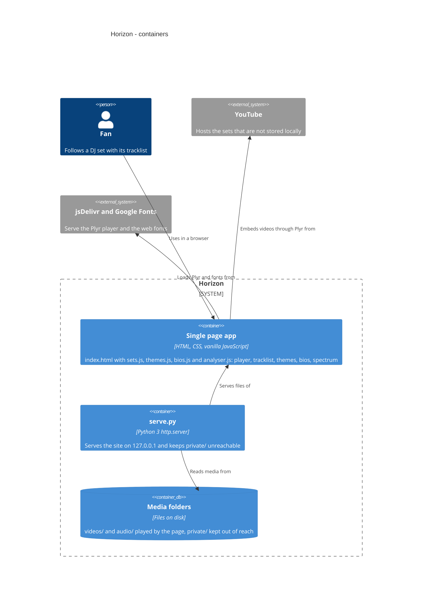

# C4 level 2: containers

A static single page app with no build step, served by a small local Python server. Media files live next to it on disk (gitignored).

```mermaid
C4Container
  title Horizon - containers
  Person(fan, "Fan", "Follows a DJ set with its tracklist")
  System_Boundary(horizon, "Horizon") {
    Container(spa, "Single page app", "HTML, CSS, vanilla JavaScript", "index.html with sets.js, themes.js, bios.js and analyser.js: player, tracklist, themes, bios, spectrum")
    Container(server, "serve.py", "Python 3 http.server", "Serves the site on 127.0.0.1 and keeps private/ unreachable")
    ContainerDb(media, "Media folders", "Files on disk", "videos/ and audio/ played by the page, private/ kept out of reach")
  }
  System_Ext(youtube, "YouTube", "Hosts the sets that are not stored locally")
  System_Ext(cdn, "jsDelivr and Google Fonts", "Serve the Plyr player and the web fonts")
  Rel(fan, spa, "Uses in a browser")
  Rel(server, spa, "Serves files of")
  Rel(server, media, "Reads media from")
  Rel(spa, youtube, "Embeds videos through Plyr from")
  Rel(spa, cdn, "Loads Plyr and fonts from")
```
